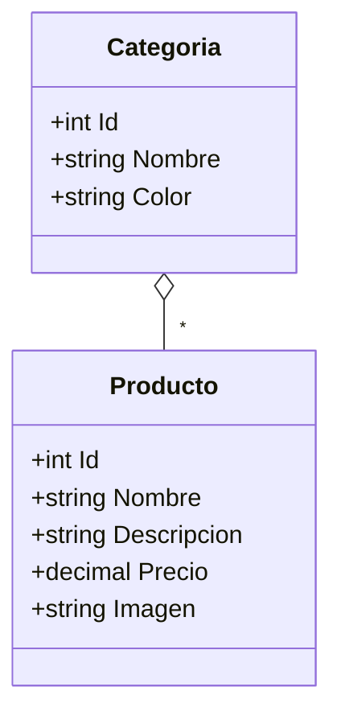

Desarrolla una API para manejar un catalogo de productos. Con esta API se podrá manejar categorias de productos y productos en si.
Una categoría tendra un nombre y se le podrá asignar un color. Un producto estará compuesto por nombre, descripción, precio e imagen.
Un producto siempre pertenecerá a una categoría. Una categoría podrá tener 0 o más productos.
La API tendrá los siguientes endpoints:

## Diagrama de clases


## GET /categorias
### Ejemplo de respuesta:
status code: 200<br>
body:
```json
[
    {
        "id": 1,
        "nombre": "Zapatos",
        "color": "#333"
    },
    {
        "id": 2,
        "nombre": "Bolsos",
        "color": "#444"
    }
]
```

## POST /categorias
### Ejemplo de petición:
body:
```json
{
    "nombre": "Cinturones",
    "color": "#555"
}
```

### Ejemplo de respuesta:
status code: 201<br>
body: 
```json
{
    "id": 3,
    "nombre": "Cinturones",
    "color": "#555"
}
```

## GET /categorias/{id}
### Ejemplo de respuesta al intentar obtener una categoria que no existe
status code: 404
    
### Ejemplo de respuesta:
status code: 200<br>
body:
```json
    {
        "id": 1,
        "nombre": "Zapatos",
        "color": "#333"
    }
```

## GET /categorias/{id}/productos
### Ejemplo de respuesta:
status code: 200<br>
body:
```json
    [
        {
            "id": 1,
            "nombre": "Zapato de piel de señora",
            "descripcion": "Zapato de tacón alto muy comodo. Revestido con piel",
            "precio": 24.99,
            "imagen": "https://unsplash.com/es/fotos/par-de-zapatos-de-tacon-marrones-de-punta-puntiaguda-para-mujer-a-bordo-Zx76sbAndc0"
         },
        {
            "id": 2,
            "nombre": "Zapato de piel de hombre",
            "descripcion": "Zapato oxford muy comodo. Revestido con piel",
            "precio": 60.99,
            "imagen": "https://unsplash.com/es/fotos/par-de-botas-marrones-de-cuero-con-cordones-WlB8TsI_th0"
         }
    ]
```

## POST /categorias/{id}/productos
### Ejemplo de petición:
```json
    {
        "nombre": "Zapato deportivo niño",
        "descripcion": "Zapato deportivo de niño para el día a día, colegio, etc.",
        "precio": 10.99,
        "imagen": "https://unsplash.com/es/fotos/persona-juega-a-la-pelota-de-futbol-en-arenas-blancas-uVrpmz1ATVg"
    }
```
### Ejemplo de respuesta:
status code: 201<br>
body:
```json
    {
        "id": 3,
        "nombre": "Zapato deportivo niño",
        "descripcion": "Zapato deportivo de niño para el día a día, colegio, etc.",
        "precio": 10.99,
        "imagen": "https://unsplash.com/es/fotos/persona-juega-a-la-pelota-de-futbol-en-arenas-blancas-uVrpmz1ATVg"
    }
```

## DELETE /categorias/{id}/productos/{id_producto}
### Ejemplo de respuesta
status code: 204

### Ejemplo de respuesta al intentar borrar un producto que no existe
status code: 404
